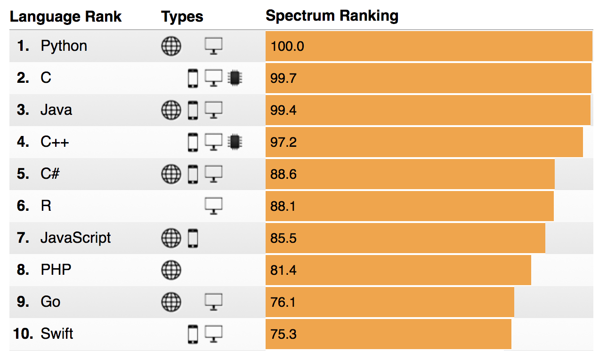
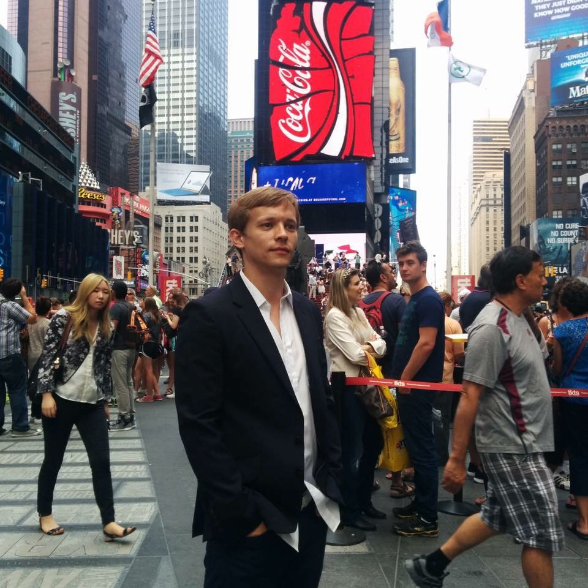

<style>
body {
  text-align: justify;
}
</style>

# MENU

1. [Introduction](#introduction)
2. [About the Instructor](#about-the-instructor)
3. [Prerequisites](#prerequisites)
4. [Evaluation](#evaluation)
5. [Syllabus](#syllabus)
    - [Resources](#resources)
    - [Lectures](#lectures)
6. [Policies](#policies)
7. [Contact](#contact)

---

# INTRODUCTION

This is an introductory Computer Science course for Keio University, covering prerequisite knowledge and skills necessary to process and analyze data. It is intended for people with no prior programming experience. We will learn some basic concepts from algorithms, data structures, and programming paradigms, with selected examples. Many of the topics we cover could take several courses on their own to explore in more detail, but our goal here is to expose students to ways of computational thinking, so they can work with data on their own using a modern programming language. We will study those topics through the lens of Python - a modern multi-paradigm programming language that is currently the top choice in a wide range of applications, especially in data science and artificial intelligence (e.g. machine learning). This course will be especially useful to people wishing to take my courses on Artificial Intelligence (focusing on neural networks and deep learning), that will be taught in the Mita campus in the following terms. However, this course does not focus on AI, but rather on developing programming skills and understanding of basic concepts in algorithms and data structures. Therefore it will be useful for anyone, without prior programming experience, who wishes to use computational methods in their own field. It is also a good primer for further self-study.

IEEE - 2017 ranking of programming languages:

<span style="display:block;text-align:center">{:height="80%" width="80%"}</span>

---

# ABOUT THE INSTRUCTOR

<span style="display:block;text-align:center">{:height="30%" width="30%"}</span>

I'm an American research scientist working on Artificial Intelligence. My main interests are Deep Neural Networks, Computational Linguistics / NLP, and Reinforcement Learning. I'm also interested in Economics, Law, and Entrepreneurship. I've been a founding member of the Chicago Innovation Exchange (center for new technology startups in Chicago, sponsored by the Booth School of Business at the University of Chicago) where I advised new technology companies. I have worked as a developer implementing artificial intelligence algorithms in a business setting, and I held executive positions in software industry. I have been applying AI techniques to a variety of problems outside of computer science, such as algorithmic trading (also winning data science competitions in the US using those approaches). My hobbies include traveling, reading, and making electronic music (I've lived in several countries and visited more than twenty, spanning multiple continents). I particularly enjoy visiting Tokyo, and it has been my frequent destination throughout life.

I did my BA at Columbia University (New York, USA), MPhil at University of Cambridge (Cambridge, U.K.), and PhD at the University of Chicago (Illinois, USA).

---

# PREREQUISITES

This is an introductory course on coding and data processing in a modern programming language. There are no formal pre-requisites. However, it is helpful to be familiar with the basics of a modern operating system usage (preferably Linux of MacOS). All software and materials will be distributed by the instructor.

Students should also familiarize themselves with git version control system ([Git](https://en.wikipedia.org/wiki/Git)). The course materials will be hosted on GitHub ([GitHub](https://github.com/)) in a course repository. Students will submit homework assignments via git. There will be a brief overview of git and GitHub during the first week of lectures.

---

# EVALUATION

Final grade for this course will be based on the following factors:

  * class attendance: 10%
  * programming assignment: 20%
  * project: 35%
  * exam: 35%

<!-- programming: perceptron / n-gram context clustering -->
<!-- project: viterbi path algorithm / viola-jones detector / denoiser -->

Grades will be communicated via [GradeScope](https://gradescope.com/).

---

# SYLLABUS

## Resources

Course materials will be posted in the course GitHub repository under the the <em>class</em> directory. In order to obtain the latest version of the repository first clone it on your system:

```
$ git clone https://github.com/stephenfitz/keio2018pyalgdat.git
```

then periodically pull the changes:

```
$ cd data-processing
$ git pull
```

Everyone should also join the [Piazza](https://piazza.com/) group for the course. The Piazza forum is a place for you to discuss lectures, assignments, projects, exams etc. with other students. You should check it often and try to answer your classmates' questions. This kind of collaborative forum is used at most US universities to improve student communication. The TA might also join and moderate the discussion on occasion. Additionally, professor or the TA might put out course related announcements and post files through Piazza.

Please use the following invitation link to the Piazza course page: 
[http://piazza.com/keio.ac.jp/spring2018/keio2018pyalgdat](http://piazza.com/keio.ac.jp/spring2018/keio2018pyalgdat).

For live discussion, as well as contacting the professor and the TA (e.g. to schedule a meeting in case of a problem etc.) there is a [Slack](https://slack.com/) channel for the course.

Please use the following invitation link to join the Slack channel: 
[https://join.slack.com/t/keio2018pyalgdat/shared_invite/enQtMzQzMDA4MDk1MjE5LWNjNTM3NGIxZWMyOWQxMjAzNThiODA0NzExZjZkODVmODcwN2VmNDI0NDE5ZWJjMjBiOGIxYTYwOWU4YzQ5NmI](https://join.slack.com/t/keio2018pyalgdat/shared_invite/enQtMzQzMDA4MDk1MjE5LWNjNTM3NGIxZWMyOWQxMjAzNThiODA0NzExZjZkODVmODcwN2VmNDI0NDE5ZWJjMjBiOGIxYTYwOWU4YzQ5NmI).

Lecture notes should be sufficient, hence attending every lecture is highly recommended. In addition to the lectures, the following books might be useful as a reference for foundational concepts (although they are not officially required for the course):

* "Learning Python", 5th edition - M. Lutz
* "Introduction to Algorithms", 3rd edition - T.H. Cormen, C.E. Leiserson, R.L. Rivest, C. Stein

## Lectures

Lectures are given once per week (15 in total), each lasting 1.5h.

Time: Thursdays, 4:30pm-6:00pm
Location: 日吉キャンパス, 第４校舎Ａ棟, J411

lecture | topics
---- | ------
1 | overview; logistics; git; Python; Data Science
2 | history of programming languages; programming paradigms
3 | introduction to algorithms; asymptotic analysis; pseudocode
4 | data structures; objects; declarative paradigm
5 | sorting; dynamic programming; shortest path
6 | Python basics; variables; expressions; functions; scope
7 | flow control (conditionals, loops); tuples; lists; dictionaries
8 | classes; principles of OOP; packages and modules
9 | generators; higher order functions
10 | useful libraries; numpy; pandas
11 | IO and system access
12 | exceptions; decorators; magic methods
13 | inheritance; metaclasses; managed attributes
14 | review; projects due
15 | TBA

---

# POLICIES

I expect students to attend all lectures. Additionally, each student should schedule office hour visitation with the instructor at least once during the course.

---

# CONTACT

You can contact the instructor at stephenf@keio.jp in case of special circumstances, but the main method of contact for course related matters will be the slack channel dedicated to this course. Office hours are by appointment within the 30min window right after the class.